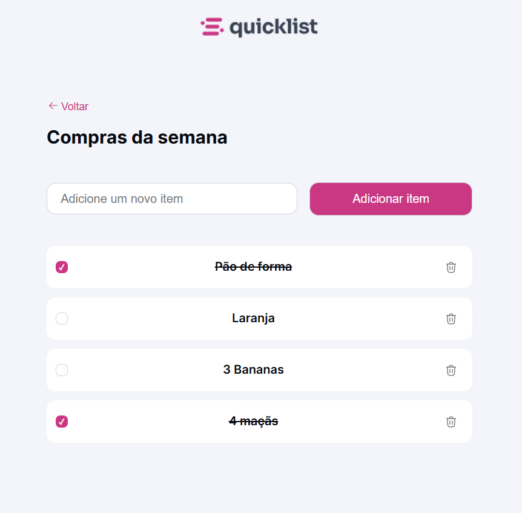

<h1 align="center"> Shopping List </h1>

Responsive shopping list website where users can manage items by adding and removing them.   

  <a href="#-tecnologias">Technologies</a>&nbsp;&nbsp;&nbsp;|&nbsp;&nbsp;&nbsp;
  <a href="#-layout">Layout</a>&nbsp;&nbsp;&nbsp;|&nbsp;&nbsp;&nbsp;

 

  

## 🚀 Technologies

This project was developed using the following technologies:

- HTML, CSS
- JavaScript
- Git e Github
- Figma

## 🔖 Layout

You can view the project layout through: [THIS LINK](https://www.figma.com/community/file/1397279978314668489). You need to have an account on [Figma](https://figma.com) to access it.
